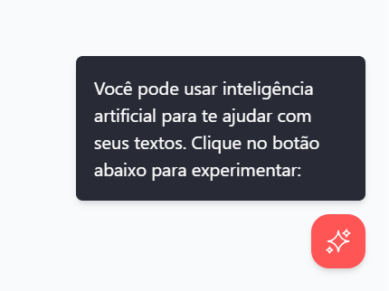
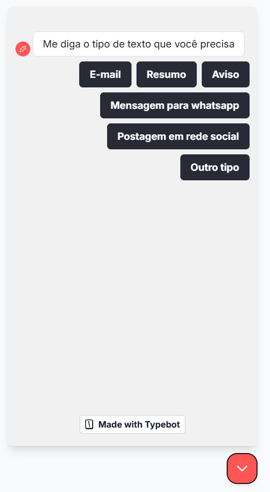
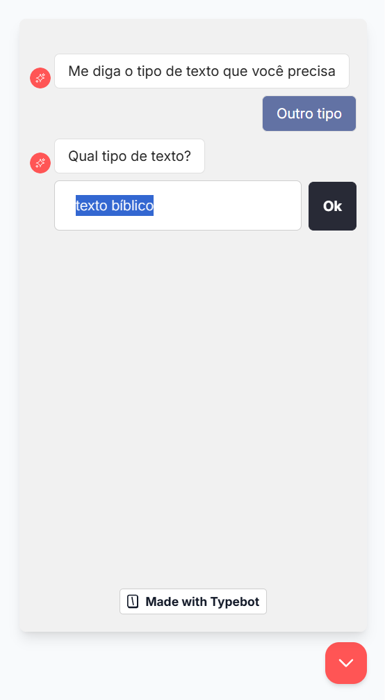
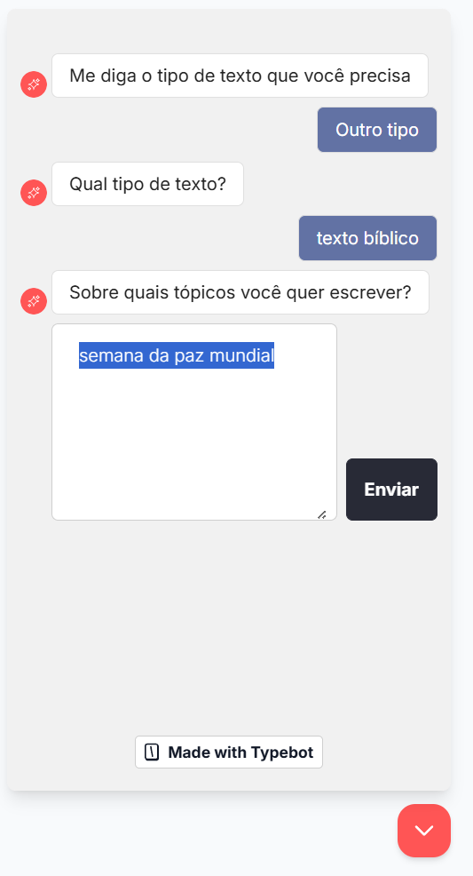
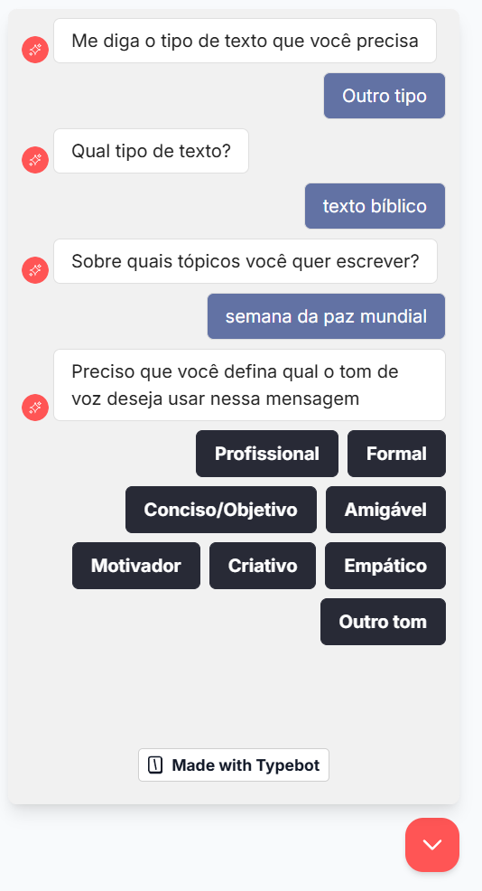
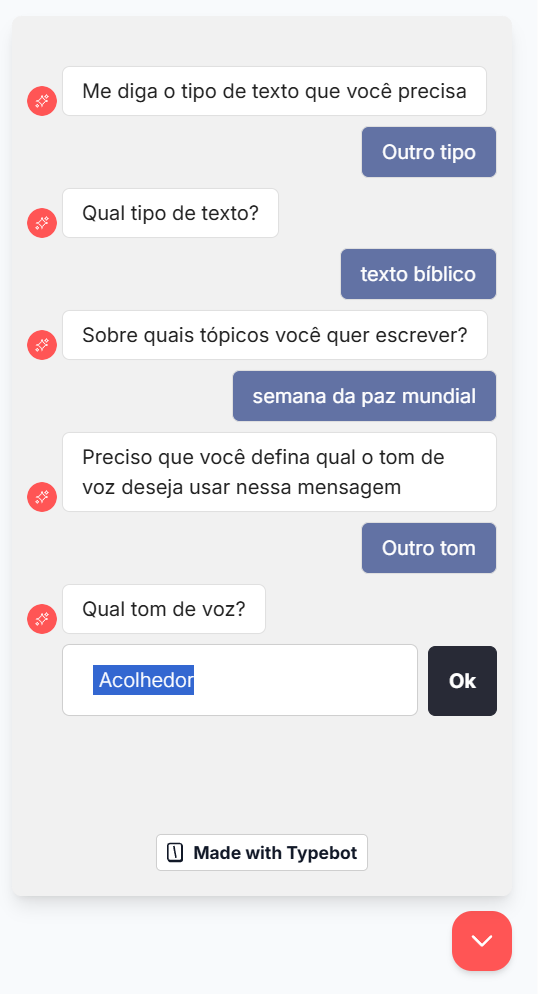
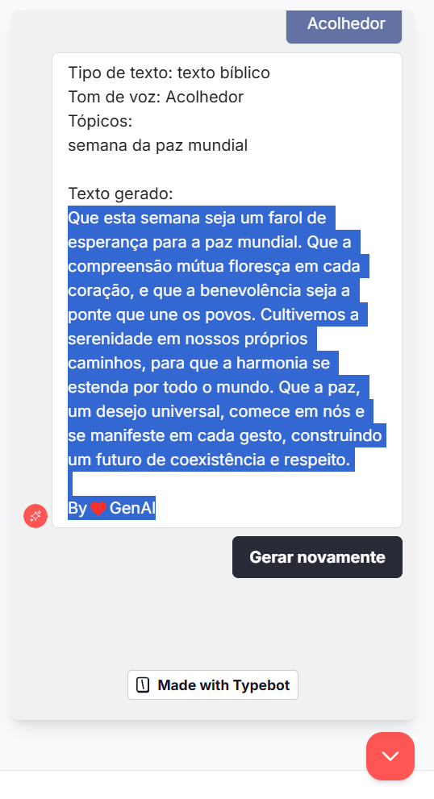

### Iniciar interação com o chat:

### Escolhe opção de tipo de texto:

### Caso escolha `Outro tipo` deverá digitar a opção:

### Preencha os tópicos

### Escolha o Tom de Voz:

### Caso escolha `Outro tom` deverá digitar o tom de voz:

### Veja o texto gerado:

### Ao clicar em `Gerar novamente` o fluxo recomeça.