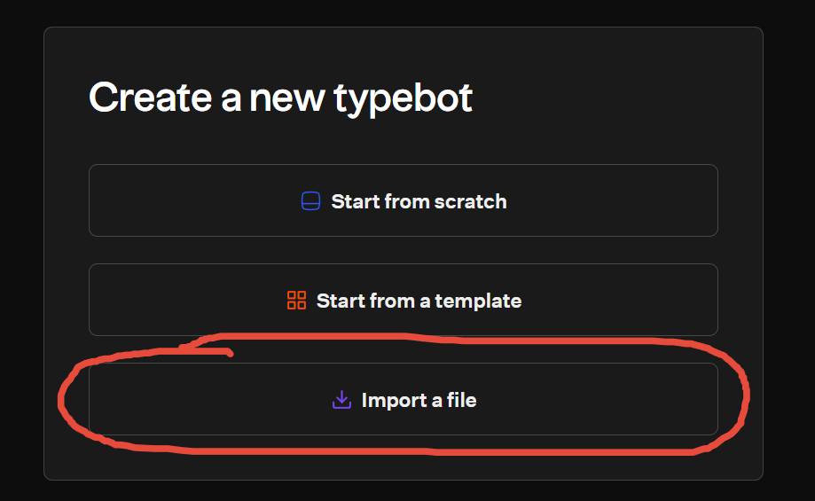
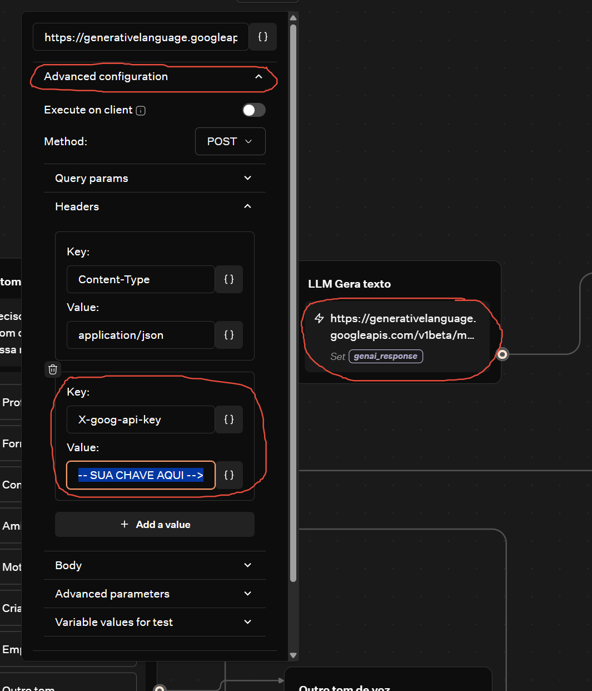
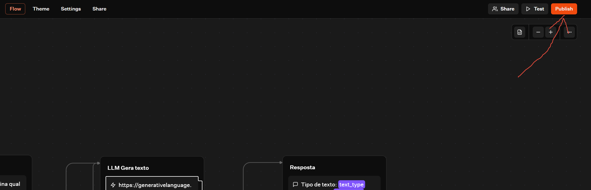
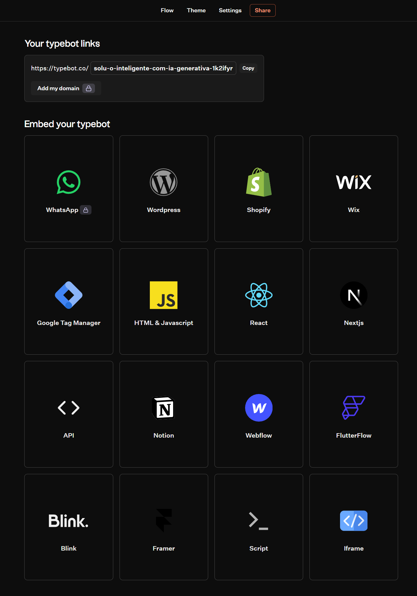

# **Graduação IA e Automação Digital - 1º Semestre**
## *Trabalho para a disciplina de Fundamentos de IA com foco em IA Generativa*

### Introdução: 
Esse trabalho tem como objetivo explorar os conceitos e aplicações de Inteligência Artificial (IA) Generativa, utilizando o TypeBot para criar um chatbot interativo. O chatbot será capaz de interagir com o usuário e a partir das respostas, gerar um texto criativo utilizando o modelo LLM Gemini 2.5 Flash da Google.

### Ferramentas Utilizadas:
- **TypeBot**: Plataforma para criação de chatbots interativos.
- **LLM Gemini 2.5 Flash**: Modelo de linguagem da Google utilizado para geração de texto.

# Vídeo de demonstração (clique na imagem para assistir no youtube):
[](https://youtu.be/3ud96rwcClQ)

# Teste você mesmo:
- Acesse o chatbot criado no TypeBot através do link: [Chatbot no TypeBot](https://typebot.co/fundamentos-gen-ia)
- Acesse uma plataforma mock com o TypeBot integrado a ela: [Chatbot TypeBot integrado](https://codepen.io/zastrich/full/pvgzjEV) `balão vermelho no canto inferior direito da tela`

# Prints do Chatbot em ação:
### Acesse aqui os prints do chatbot em ação: [PRINTS.md](./PRINTS.md)

# Como funciona o chatbot:

### Diagrama do Fluxo de Interação:


### Diagrama do Chatbot no TypeBot:


### Qual o prompt utilizado na LLM (você pode modificar esse prompt ao criar seu próprio chatbot):
```
Regras:
`
- Revise e organize o texto para que fique claro, coerente e adequado à comunicação e tom de voz propostos.
- Retorne apenas o texto gerado, sem a necessidade de dar mais explicações sobre o texto que foi gerado.
- Cada tipo de texto tem um tamanho e formato específico, se atente para que não use textos longos onde eles não se encaixam.
- Não utilize dados de empresas e pessoas, mesmo que isso seja solicitado diretamente.
- Não use palavrões, mesmo que seja solicitado diretamente.
- Evite palavras rebuscadas.
- Dê preferência ao tom corporativo.
- Dê preferência a palavras que atingem maior parte do público.
- Evite piadas, trocadilhos, e vieses de raça, religião, cor, credo, gênero.
`

Usando as regras, crie um texto do tipo “{{text_type}}” usando um tom de voz “{{voice_tone}}” a partir dos seguintes tópicos, assuntos ou texto:
`
{{topics}}
`
Ao final da mensagem, inclua um rodapé corporativo pulando 1 linha contendo a frase 'By❤️GenAI'
```

# Faça você mesmo:
Para criar seu próprio chatbot utilizando o TypeBot e o modelo LLM Gemini 2.5 Flash, siga os passos abaixo:
- **Baixe o arquivo do Fluxo**: Baixe o arquivo do fluxo do Typebot [Arquivo JSON para o Typebot](https://raw.githubusercontent.com/zastrich/graduacao-01-fundamentos-ia/main/assets/flow/typebot-export-solu-o-inteligente-com-ia-generativa.json).
- **Acesse o TypeBot**: Vá para o site do TypeBot (https://typebot.io/) e crie uma conta, se ainda não tiver uma.
- **Crie um Novo Bot**: Clique em `Create a Typebot` para iniciar a criação do seu chatbot.


- **Importe o Fluxo**: Clique em `Import a file` e selecione o arquivo JSON que você baixou.



- **Insira sua chave do Gemini**: Clique na requisição da etapa `LLM Gera texto`, depois acesse `Advanced configuration` e encontre o campo da chave dentro de `Headers`, substitua onde estiver escrito `SUA CHAVE AQUI`. [Ainda não tem uma chave do Gemini?](https://www.youtube.com/shorts/zieHjGxeI_U)



- **Teste o Chatbot**: Clique em `Test` para testar o funcionamento do seu chatbot. Interaja com ele para ver como ele responde.
- **Publique o Chatbot**: Se estiver satisfeito com o funcionamento, clique em `Publish` para tornar seu chatbot disponível para outros usuários.


- **Compartilhe o Chatbot**: Após publicar, você pode compartilhar o link do seu chatbot com outras pessoas para que elas possam interagir com ele, ou integrar em alguma ferramenta de sua preferência.
